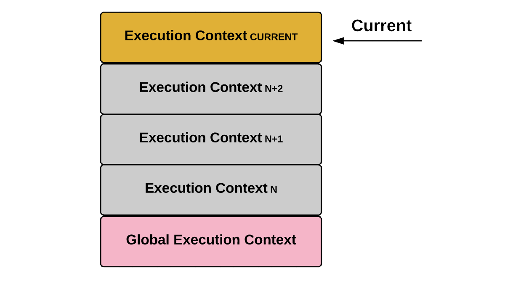

# JavaScript Note

> 深度理解javascript運作原理


---

### Table of Contents

| No. | Questions |
|---- | ---------
|1  | [Execution Context 執行環境](#Execution-Context-執行環境) |
|2  | [Lexical Environment 詞法環境](#Lexical-Environment-詞法環境) |


------------------------------


1. ### Execution Context 執行環境
   > 關鍵字: Execution Context 執行環境 執行上下文

   **什麼是Execution Context**

      `Execution Context` 就是執行javascript code時候的環境，用於跟javascript code的運算時求值等，任何javascript code執行的時候都是處於一個 `Execution Context` 之中。

      `Execution Stack` 掌管了 `Execution Context` 創建後的執行順序。當javascript code值型會將創建後的`Execution Stack` 層層疊入，並順著作用域鏈 `scope chain` 訪問變量、如果內部有函數invoke就創建一個新的 `Execution Context` ，把原先的push下去並把控制權交出。

   

   **Execution Stack**

      * `Execution Stack` 為 `Execution Context` 執行順序的stack，會將建立階段的 `Execution Context` 依順序push & pop ，其順序為FILO(First In, Last Out)。
      * 當引擎執行你的javascript code時，會先建立一個 `Gobal Execution Context` 並且把他push進 `Execution Stack`。
      * 而當執行到function時，會建立 `Functional Execution Context` ，如果有很多function，就會一層疊一層的方式push進去。
      * 每次從 `Execution Stack` 最上方 pop一個 `Execution Context` 並執行稱之為 `call stack` 。

      以下範例解釋 Execution Stack流程
      
      ```javascript
      let a = 'Hello World!';
      function first() {
        console.log('Inside first function');
        second();
        console.log('Again inside first function');
      }
      function second() {
        console.log('Inside second function');
      }
      first();
      console.log('Inside Global Execution Context');
      ```


      
      > An Execution Context Stack for the above code.


      * 上面JavaScript code在瀏覽器中執行時，JavaScript 引擎會先創建一個 `Gobal Execution Context` 並把它push進 `Execution Stack` 中。碰到 first() 執行時，引擎給這個函數創建一個新的 `Execution Context` ，然後把它push進 `Execution Stack` 的頂部。


      * 當 second() 在 first() 函數內部執行時，引擎會給 second 創建 `Execution Context` 並把它push進 `Execution Stack` 頂部，當 second 函數執行完畢，它的 `Execution Context` 就會從 `Execution Stack` 最上方pop，指針會指向它下面的 `Execution Context` ，也就是 first 函數的 `Execution Context`。


      * 當 first 函數執行完畢其 `Execution Context` 也會從最上方pop，指針就指向了 `Gobal Execution Context` 。當所有的代碼執行完畢，引擎會把 `Gobal Execution Context` 也從 `Execution Stack` 中移出。


   **Execution Context的種類**
      
      Execution Context一共有三種:
      1. Gobal Execution Context:
          * 預設或是基本的 `Execution Context`。
          * 在一個程序(program)中只會有一個 `Gobal Execution Context`。
          * 建立 
            * `global object` (在瀏覽器是 `window` )。
            * `this`，並把 `this` 指向 `global object` 。
          
      2. Functional Execution Context:
          * 執行function的時候，會創立一個新的 `Functional Execution Context` ，每一個function執行都會有自己的 `Execution Context` 。
          * 相同的function code在不同的執行階段會建立各自的 `Execution Context` 。
      3. Eval:
          * 在 eval 函數中執行的javascript code也會有自己的 `Execution Context` ，但由於 eval 因為安全因素已經不常用了，所以此篇不討論。

      
   **Execution Context 階段**

      `Execution Context`有兩個階段:
      1. 建立階段 `The Creation Phase`
      2. 執行階段 `The Execution Phase`

      * 建立階段 `The Creation Phase`

        `Execution Context`的創建階段，發生在function invoke時且在執行函數內的code之前，在創建階段js 引擎會做如下操作：

        * 創建 詞法環境( `Lexical Environment` ) 與 變量環境( `Variable Environment` )
        * 建立`this`，建立全域物件 `global object`
          * binding `this` ，而 `global object` 只有在 ` Gobal Execution Context` 的時候才會建立。
        * 建立外部環境 `Outer Environment`
          * 對於 `Gobal Execution Context` 而言，其 `Outer Environment` 為null，對於 `Functional Execution Context` 而言，如果 function b 包在 function a 裡面，那 function b 的外部環境就是 function a
        * `Hoisting` : 在建立階段預先將變數分配記憶體空間並預設賦值為 undefined 

        所以從概念來說 `Execution Context` 可以用js object的方式表示

        ``` javascript
        let a = 20;
        const b = 30;
        var c;
        function multiply(e, f) {
          var g = 20;
          return e * f * g;
        }
        c = multiply(20, 30);
        ```

        ``` javascript
        // Global EC
        GlobalExectionContext = {
          LexicalEnvironment: {
              EnvironmentRecord: {
                Type: "Object",
                // Identifier bindings go here
                a: 20,
                b: 30,
                multiply: < func >
              }
              outer: <null>,
              ThisBinding: <Global Object>
            },
          VariableEnvironment: {
              EnvironmentRecord: {
                Type: "Object",
                // Identifier bindings go here
                c: undefined,
              }
              outer: <null>,
              ThisBinding: <Global Object>
            }
        }
        ```
        ``` javascript
        // EC of multiply()
        FunctionExectionContext = {
          LexicalEnvironment: {
              EnvironmentRecord: {
                Type: "Declarative",
                // Identifier bindings go here
                Arguments: {0: 20, 1: 30, length: 2},
              },
              outer: <GlobalLexicalEnvironment>,
              ThisBinding: <Global Object or undefined>,
            },
          VariableEnvironment: {
              EnvironmentRecord: {
                Type: "Declarative",
                // Identifier bindings go here
                g: undefined
              },
              outer: <GlobalLexicalEnvironment>,
              ThisBinding: <Global Object or undefined>
          }
        }
        ```

        而有關`Lexical Environment`我們下個章節再說。

      * 執行階段 `The Execution Phase`

        在此階段，完成了對所有變數分配，執行了JavaScript code並pop出`Execution Stack`。


   **reference**
     * [JavaScript: Understanding the Weird Parts](https://www.udemy.com/course/understand-javascript/)
     * [Understanding Execution Context and Execution Stack in Javascript](https://blog.bitsrc.io/understanding-execution-context-and-execution-stack-in-javascript-1c9ea8642dd0)

     **[Back to Top](#table-of-contents)**


2. ### Lexical Environment 詞法環境

   > Execution Context 執行環境 執行上下文

   1. **Lexical Environment**  詞法環境:
      ES6 [官方文件](http://ecma-international.org/ecma-262/6.0/)是這樣定義詞法環境的

      > A Lexical Environment is a specification type used to define the association of Identifiers to specific variables and functions based upon the lexical nesting structure of ECMAScript code. A Lexical Environment consists of an Environment Record and a possibly null reference to an outer Lexical Environment.
      
      * `Lexical Environment` : 在code中真實存在的位置以及周圍的內容。 在JavaScript中它的位置及順序。
      
      * 函式內的{...}即為一個`Lexical Environment`

        ``` javascript
        function helloWorld(){
          let text = 'hello world!'
        }
        ```
      * 每當函式被呼叫時，都會產生一組新的語彙環境 (`Lexical Environment`)。

      
    * `Variable Environment`變量環境:
      * 為特化的`Lexical Environment`，其內只存變數`var`，

   2. **Execution Context 建立階段**  `The Creation Phase`:

      * 創建 詞法環境(`Lexical Environment`)
      * 創建 變量環境(`Variable Environment`)
        
      所以從概念來說`Execution Context`可以用下邊的方式表示

      ``` javascript
      ExecutionContext = {
        LexicalEnvironment = <ref. to LexicalEnvironment in memory>,
        VariableEnvironment = <ref. to VariableEnvironment in  memory>,
      }
      ```

      舉例來說下方 javaScript code

      ``` javascript
      var a = 20;
      var b = 40;
      function foo() {
        console.log('bar');
      }
      ```

      其 詞法環境`lexical environment`建立後會如

      ``` javascript
      lexicalEnvironment = {
        a: 20,
        b: 40,
        foo: <ref. to foo function>
      }
      ```

      而每一個詞法環境`lexical environment`內有以下三種元素

      * Environment Record
      * Reference to the outer environment,
      * This binding.

      1. **Environment Record**

          The environment record is the place where the variable and function declarations are stored inside the lexical environment.

          There are also two types of environment record :

          * Declarative environment record 
            * As its name suggests stores variable and function declarations. The lexical environment for function code contains a declarative environment record.
          * Object environment record 
            * lexical environment for global code contains a objective environment record. Apart from variable and function declarations, the object environment record also stores a global binding object (window object in browsers). So for each of binding object’s property (in case of browsers, it contains properties and methods provided by browser to the window object), a new entry is created in the record.

          **Note** — For the function code, the environment record also contains an arguments object that contains the mapping between indexes and arguments passed to the function and the length(number) of the arguments passed into the function. For example, an argument object for the below function looks like this:

          ``` javascript
          function foo(a, b) {
            var c = a + b;
          }
          foo(2, 3);
          // argument object
          Arguments: {0: 2, 1: 3, length: 2},
          ```

      2. **Reference to the Outer Environment**

          The reference to the outer environment means it has access to its outer lexical environment. That means that the JavaScript engine can look for variables inside the outer environment if they are not found in the current lexical environment.

      3. **This Binding**

          In this component, the value of this is determined or set.
          In the global execution context, the value of this refers to the global object. (in browsers, this refers to the Window Object).
          In the function execution context, the value of this depends on how the function is called. If it is called by an object reference, then the value of this is set to that object, otherwise, the value of this is set to the global object or undefined(in strict mode). For example:

          ``` javascript
          const person = {
            name: 'peter',
            birthYear: 1994,
            calcAge: function() {
              console.log(2018 - this.birthYear);
            }
          }
          person.calcAge(); 
          // 'this' refers to 'person', because 'calcAge' was called with //'person' object reference
          const calculateAge = person.calcAge;
          calculateAge();
          // 'this' refers to the global window object, because no object reference was given
          ```

      *  lexical environment looks like this in pseudocode

          ``` javascript
          GlobalExectionContext = {
            LexicalEnvironment: {
              EnvironmentRecord: {
                Type: "Object",
                // Identifier bindings go here
              }
              outer: <null>,
              this: <global object>
            }
          }
          ```

          ``` javascript
          FunctionExectionContext = {
            LexicalEnvironment: {
              EnvironmentRecord: {
                Type: "Declarative",
                // Identifier bindings go here
              }
              outer: <Global or outer function environment reference>,
              this: <depends on how function is called>
            }
          }
          ```


   * reference
     * [JavaScript: Understanding the Weird Parts](https://www.udemy.com/course/understand-javascript/)
     * [Understanding Execution Context and Execution Stack in Javascript](https://blog.bitsrc.io/understanding-execution-context-and-execution-stack-in-javascript-1c9ea8642dd0)

      **[Back to Top](#table-of-contents)**


1.在ES6前，声明变量都是通过var关键词声明的，在ES6中则提倡使用let和const来声明变量，为了兼容var的写法，于是使用变量环境来存储var声明的变量。
2.当遇到Block或CaseBlock时，将会新建一个环境记录，在块中声明的let/const变量、函数、类都存放这个新的环境记录中，这些变量与块强绑定，在块外界则无法读取这些声明的变量。这个特性就是我们熟悉的块作用域。
