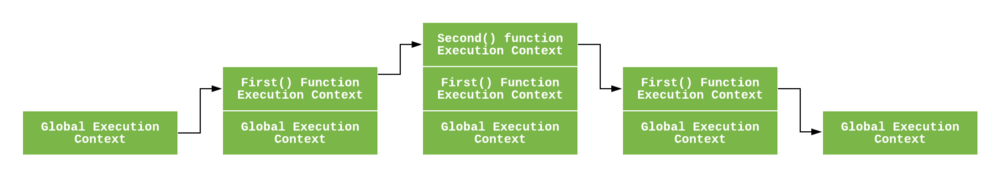

# JavaScript Note

> 深度理解javascript運作原理


---

### Table of Contents

| No. | Questions |
|---- | ---------
|1  | [Execution Context 執行環境](#Execution-Context-執行環境) |


1. ### Execution Context 執行環境

   > Execution Context 執行環境 執行上下文

   1. **什麼是Execution Context**

      `Execution Context`就是執行javascript code時候的環境，任何javascript code執行的時候都是處於一個`Execution Context`之中。

   2. **Execution Context的種類**
      
      Execution Context一共有三種:
      1. Gobal Execution Context:
          * 預設或是基本的`Execution Context`。
          * 建立 `this` 與 `global object`(在瀏覽器是`window`)，並把`this`指向`global object`。
          * 在一個程序(program)中只會有一個`Gobal Execution Context`。
      2. Functional Execution Context:
          * 執行function的時候，會創立一個新的`Functional Execution Context`，每一個function執行都會有自己的`Execution Context`。
          * 相同的function code在不同的執行階段會建立各自的`Execution Context`
      3. Eval:
          * 在 eval 函數中執行的javascript code也會有自己的`Execution Context`，但由於 eval 因為安全因素已經不常用了，所以此篇不討論。


   3. **Execution Stack**

      * `Execution Stack`為`Execution Context`執行順序的stack，會將建立階段的`Execution Context`依順序push & pop ，其為FILO(First In, Last Out)。
      * 當引擎執行你的javascript code時，會先建立一個`Gobal Execution Context`並且把他push進`Execution Stack`。
      * 而當執行到function時，會建立`Functional Execution Context`，如果有很多function，就會一層疊一層的方式push進去。
      * 每次從`Execution Stack`最上方 pop一個`Execution Context`並執行稱之為`call stack`。


      以下範例解釋 Execution Stack流程
      

      ```javascript
      let a = 'Hello World!';
      function first() {
        console.log('Inside first function');
        second();
        console.log('Again inside first function');
      }
      function second() {
        console.log('Inside second function');
      }
      first();
      console.log('Inside Global Execution Context');
      ```


      
      > An Execution Context Stack for the above code.


      * 上面JavaScript code在瀏覽器中執行時，JavaScript 引擎會先創建一個`Gobal Execution Context`並把它push進`Execution Stack`中。碰到 first() 執行時，引擎給這個函數創建一個新的`Execution Context`，然後把它push進`Execution Stack`的頂部。


      * 當 second() 在 first() 函數內部執行時，引擎會給 second 創建`Execution Context`並把它push進`Execution Stack`頂部，當 second 函數執行完畢，它的`Execution Context`就會從`Execution Stack`最上方pop，指針會指向它下面的`Execution Context`，也就是 first 函數的`Execution Context`。


      * 當 first 函數執行完畢其`Execution Context`也會從最上方pop，指針就指向了`Gobal Execution Context`。當所有的代碼執行完畢，引擎會把`Gobal Execution Context`也從`Execution Stack`中移出。

      
   4. Execution Context 建立與執行2階段

      `Execution Context`有兩個階段:
      1. 建立階段
      2. 執行階段

      * 建立階段
         * 創建 詞法環境(`Lexical Environment`)
         * 創建 變量環境(`Variable Environment`)
        
        所以從概念來說`Execution Context`可以用下邊的方式表示

        ``` javascript
        ExecutionContext = {
          LexicalEnvironment = <ref. to LexicalEnvironment in memory>,
          VariableEnvironment = <ref. to VariableEnvironment in  memory>,
        }
        ```

        * `Lexical Environment` 詞法環境:

          ES6 [官方文件](http://ecma-international.org/ecma-262/6.0/)是這樣定義詞法環境的

          > A Lexical Environment is a specification type used to define the association of Identifiers to specific variables and functions based upon the lexical nesting structure of ECMAScript code. A Lexical Environment consists of an Environment Record and a possibly null reference to an outer Lexical Environment.
          
          * `Lexical Environment` : 在code中真實存在的位置以及周圍的內容。 在JavaScript中它的位置及順序。
          
          * 函式內的{...}即為一個`Lexical Environment`

            ``` javascript
            function helloWorld(){
              let text = 'hello world!'
            }
            ```
          * 每當函式被呼叫時，都會產生一組新的語彙環境 (`Lexical Environment`)。

          
        * `Variable Environment`變量環境:
          * 為特化的`Lexical Environment`，其內只存變數`var`，


      * 執行階段
        在此階段，完成了對所有變數分配，並執行了JavaScript code。


   * reference
     * [JavaScript: Understanding the Weird Parts](https://www.udemy.com/course/understand-javascript/)
     * [Understanding Execution Context and Execution Stack in Javascript](https://blog.bitsrc.io/understanding-execution-context-and-execution-stack-in-javascript-1c9ea8642dd0)

      **[⬆ Back to Top](#table-of-contents)**